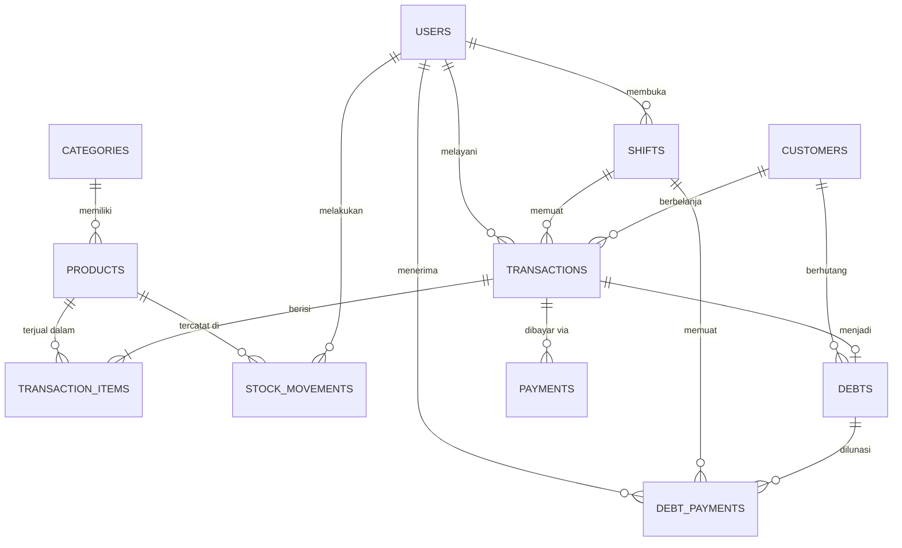

# Product Requirements Document (PRD)

## OrderKasir — Aplikasi Kasir Offline untuk Toko Retail & Warung

| | |
|---|---|
| **Nama Produk** | OrderKasir |
| **Versi Dokumen** | 1.0 |
| **Tanggal** | 22 Agustus 2026 |
| **Status** | Disetujui — Siap Dikembangkan |
| **Platform** | Android (React Native CLI) |
| **Target Rilis MVP** | Q4 2026 |

---

## Daftar Isi

1. [Ringkasan Eksekutif](#1-ringkasan-eksekutif)
2. [Masalah & Peluang](#2-masalah--peluang)
3. [Target Pengguna & Persona](#3-target-pengguna--persona)
4. [User Stories](#4-user-stories)
5. [Spesifikasi Fitur MVP](#5-spesifikasi-fitur-mvp)
6. [Non-Functional Requirements](#6-non-functional-requirements)
7. [Arsitektur & Tech Stack](#7-arsitektur--tech-stack)
8. [Roadmap Fase](#8-roadmap-fase)
9. [Metrik Sukses (KPI)](#9-metrik-sukses-kpi)
10. [Risiko & Mitigasi](#10-risiko--mitigasi)
11. [Out of Scope](#11-out-of-scope)
12. [Pertanyaan Terbuka](#12-pertanyaan-terbuka)

---

## 1. Ringkasan Eksekutif

### 1.1 Visi

Menjadi aplikasi kasir (Point of Sale) yang paling mudah digunakan oleh pemilik warung dan toko retail kecil di Indonesia — bekerja penuh tanpa internet, dengan data yang tetap aman melalui backup cloud otomatis saat koneksi tersedia.

### 1.2 Deskripsi Produk

OrderKasir adalah aplikasi kasir Android offline-first yang membantu pemilik warung/toko retail mencatat penjualan, mengelola stok produk, memantau laba, mengelola piutang pelanggan (kas bon), dan mengatur shift kasir — semuanya dari satu perangkat Android.

### 1.3 Value Proposition

| Nilai | Penjelasan |
|---|---|
| **100% Offline** | Semua fitur inti berjalan tanpa internet — cocok untuk lokasi sinyal tidak stabil |
| **Aman & Andal** | Data tersimpan lokal + auto-backup ke cloud ketika online, tidak ada lagi catatan hilang |
| **Sederhana** | UI berbahasa Indonesia dirancang untuk pengguna non-teknis, operasional bisa dipelajari < 15 menit |
| **Terjangkau** | Tanpa biaya perangkat keras mahal; cukup HP Android + printer bluetooth murah |
| **Lengkap untuk UMKM** | Kasir, stok, laporan laba, kas bon, dan shift dalam satu aplikasi |

---

## 2. Masalah & Peluang

### 2.1 Masalah yang Diselesaikan

Pemilik warung dan toko retail kecil di Indonesia umumnya:

1. **Mencatat transaksi manual** (buku tulis / ingatan) → rawan selisih kas, sulit audit.
2. **Tidak tahu laba riil** → harga beli vs jual tidak tercatat sistematis; produk rugi tak terdeteksi.
3. **Stok tidak terkontrol** → kehabisan barang laris tanpa sadar; barang menumpuk di rak lain.
4. **Kas bon tidak tercatat** → piutang hilang atau salah hitung, merugikan hubungan pelanggan.
5. **Solusi cloud-only gagal** → banyak aplikasi kasir existing bergantung internet; saat sinyal mati, transaksi berhenti.

### 2.2 Peluang Pasar

- 60+ juta UMKM di Indonesia, mayoritas sektor perdagangan ritel.
- Adopsi smartphone Android tingkat rendah–menengah sudah masif.
- Kebutuhan pencatatan digital meningkat seiring digitalisasi pembayaran (QRIS).

---

## 3. Target Pengguna & Persona

### Persona 1 — "Budi", Pemilik Warung (Primary User)

| Atribut | Detail |
|---|---|
| Usaha | Warung kelontong, omzet ± Rp 2–5 juta/hari |
| Perangkat | HP Android entry-level (RAM 2–3 GB), Android 8+ |
| Kemampuan teknis | Dasar — hanya familiar WhatsApp & marketplace |
| Tujuan | Tahu untung/rugi harian, stok tidak bocor, kas bon tertib |
| Pain point | Takut ribet, takut data hilang, sinyal di lokasi sering buruk |
| Kriteria sukses | Bisa input produk & transaksi tanpa bantuan orang lain |

### Persona 2 — "Sari", Karyawan Kasir (Secondary User)

| Atribut | Detail |
|---|---|
| Peran | Kasir shift pagi/sore di toko milik pemberi kerja |
| Tujuan | Proses transaksi cepat, struk keluar, serah terima shift jelas |
| Pain point | Selisih kas saat serah terima disalahkan padanya |
| Kriteria sukses | Tutup shift otomatis merekap setoran & selisih secara transparan |

### Hak Akses Pengguna (Roles)

| Role | Kapabilitas |
|---|---|
| **Admin/Owner** | Semua akses: laporan laba, HPP, manajemen user, pengaturan, export data |
| **Kasir** | Transaksi, lihat produk & stok, buka/tutup shift sendiri, kas bon (dengan persetujuan admin opsional) |

---

## 4. User Stories

Format: *Sebagai [peran], saya ingin [aksi], sehingga [manfaat].*

### Autentikasi & Shift

- **US-01** — Sebagai pengguna, saya ingin login dengan PIN agar perangkat aman dipakai bergantian.
  - *AC:* PIN minimal 4 digit; PIN tersimpan ter-hash; 5x salah PIN → lockout 30 detik; role ditentukan owner saat membuat akun.
- **US-02** — Sebagai kasir, saya ingin membuka shift dengan mencatat modal awal agar uang di kasir terhitung.
  - *AC:* Hanya satu shift aktif per device; waktu buka & nominal modal tercatat.
- **US-03** — Sebagai kasir, saya ingin menutup shift dan melihat ringkasan (total penjualan tunai/non-tunai, setoran fisik, selisih) agar serah terima transparan.
  - *AC:* Sistem hitung expected cash = modal awal + penjualan tunai − pengambilan uang; selisih = setoran fisik − expected; rekap tersimpan dan dapat dicetak/dilihat admin.

### Kasir / POS

- **US-04** — Sebagai kasir, saya ingin menambahkan produk ke keranjang via scan barcode, pencarian nama, atau tap grid produk agar transaksi cepat (< 20 detik/transaksi).
- **US-05** — Sebagai kasir, saya ingin mengubah qty, hapus item, dan memberi diskon (per item / per transaksi, Rp atau %).
- **US-06** — Sebagai kasir, saya menerima pembayaran tunai dengan input nominal cepat (uang pas, 20rb, 50rb, 100rb) dan sistem menghitung kembalian.
- **US-07** — Sebagai kasir, saya dapat mencatat pembayaran QRIS/debit/transfer manual (konfirmasi lewat mesin EDC/QRIS eksternal) agar semua metode tercampur rapi dalam laporan.
  - *AC:* Transaksi multi-metode split payment didukung (mis. tunai Rp 50rb + QRIS Rp 13rb).
- **US-08** — Sebagai kasir, saya ingin cetak/reprint struk via printer bluetooth.
- **US-09** — Sebagai admin/kasir, saya bisa void/batalkan transaksi dengan alasan (hak void: admin, atau kasir dengan approval PIN admin).

### Produk & Stok

- **US-10** — Sebagai admin, saya ingin CRUD produk (nama, barcode, kategori, satuan, HPP, harga jual, stok, stok minimum, foto opsional).
- **US-11** — Sebagai admin, saya ingin scan barcode untuk cek stok cepat.
- **US-12** — Sebagai admin, saya ingin adjustment stok (tambah/kurang dengan alasan: barang rusak, opname, dll.) dan riwayatnya tercatat.
- **US-13** — Sebagai admin, saya ingin peringatan saat stok menyentuh batas minimum agar restock tepat waktu.
- **US-14** — Sebagai admin, saya ingin import/export produk via CSV agar onboarding ratusan SKU cepat.

### Piutang / Kas Bon

- **US-15** — Sebagai kasir/admin, saya bisa membuat bon atas nama pelanggan dari keranjang transaksi.
- **US-16** — Sebagai admin, saya bisa melihat daftar piutang per pelanggan (total, sisa, jatuh tempo) dan menerima pelunasan parsial/penuh.
- **US-17** — Sebagai admin, saya mendapat pengingat bon jatuh tempo hari ini.

### Laporan & Analitik

- **US-18** — Sebagai admin, saya ingin laporan penjualan per hari/minggu/bulan (omzet, jumlah transaksi, rata-rata basket).
- **US-19** — Sebagai admin, saya ingin laporan laba kotor (harga jual − HPP) per periode dan per produk.
- **US-20** — Sebagai admin, saya ingin melihat produk terlaris & metode pembayaran breakdown.
- **US-21** — Sebagai admin, saya ingin riwayat transaksi lengkap + detail + filter tanggal/metode/kasir, dan export CSV.

### Backup & Sinkronisasi

- **US-22** — Sebagai admin, saya ingin data otomatis ter-backup ke cloud saat online dan restore saat ganti HP agar usaha tidak bergantung satu perangkat.
- **US-23** — Sebagai admin, saya juga bisa export/import file database lokal (.json/.zip) sebagai cadangan manual.

---

## 5. Spesifikasi Fitur MVP

### 5.1 Autentikasi & Manajemen Shift Kasir

**Prioritas:** P0 (must-have)

- Login PIN per user; user dikelola oleh Admin (create/edit/nonaktifkan).
- **Buka Shift**: input modal awal kas → shift aktif dimulai.
- Selama shift: semua transaksi terikat ke shift tersebut.
- **Tutup Shift**: form setoran fisik → sistem hitung `expected_cash`, `selisih`, ringkasan (jumlah transaksi, omzet per metode, diskon diberikan, void).
- Riwayat shift dapat dilihat Admin beserta detail selisih per kasir.
- Pengambilan uang dari kasir (cash drawer pull) tercatat sebagai event.

### 5.2 Layar Kasir (POS Core)

**Prioritas:** P0

- Layout: panel kiri = katalog (grid/list, tab kategori), panel kanan = keranjang (di layar kecil: bottom sheet).
- Tambah produk: tap kartu produk, scan barcode (scanner eksternal/kamera), cari nama/SKU.
- Keranjang: edit qty (+/−/input), hapus item, catatan item (opsional), diskon item (Rp/%), diskon transaksi (Rp/%).
- Info live: subtotal, total diskon, pajak opsional (configurable, default nonaktif), total bayar.
- Pembayaran:
  - **Tunai**: input uang diterima (shortcut nominal pecahan), kembalian dihitung & ditampilkan besar.
  - **QRIS / Debit / Transfer**: pilih metode → input referensi (opsional) → konfirmasi. Tidak ada integrasi API pembayaran di v1 (dicatat manual).
  - **Split payment**: kombinasi hingga 3 metode dalam satu transaksi.
  - **Kas bon**: pilih pelanggan (atau buat baru inline) → transaksi masuk ke piutang.
- Setelah sukses: layar sukses + kembalian + tombol cetak struk.
- Transaksi tersimpan lokal secara atomik (keranjang + mutasi stok + piutang dalam satu DB transaction).
- Mode offline penuh: tidak ada satu alur pun yang membutuhkan jaringan.

### 5.3 Struk (Receipt)

- Cetak via printer thermal bluetooth 58 mm / 80 mm (protokol ESC/POS).
- Konten struk: nama toko + logo (opsional), alamat, nomor transaksi, tanggal-waktu, nama kasir, rincian item, diskon, total, metode bayar, tunai/kembalian, footer custom ("Terima kasih").
- Reprint struk dari riwayat transaksi.
- Pengaturan: ukuran kertas, jumlah copy, footer text.
- Jika printer tidak tersedia: struk tetap tersimpan digital, dapat dibagikan sebagai teks/gambar (WhatsApp).

### 5.4 Integrasi Hardware

**Printer Bluetooth**
- Scan & pairing perangkat bluetooth classic dari dalam app; simpan printer default.
- Test print dari halaman pengaturan.
- Penanganan error jelas (printer tidak terhubung / kertas habis) dengan opsi retry.
- Kompatibilitas target: printer ESC/POS generik (58mm & 80mm) — mayoritas merk lokal kompatibel.

**Barcode Scanner**
- Scanner eksternal mode keyboard-wedge (USB OTG / bluetooth): karakter diteruskan ke field pencarian fokus → Enter menambahkan produk ke keranjang.
- Scan via kamera: gunakan ML Kit Barcode Scanning (EAN-13, EAN-8, UPC, Code128, Code39, QR).
- Scan barcode saat tambah/edit produk untuk mengisi field barcode otomatis.

### 5.5 Manajemen Produk & Stok

- Field produk: nama, barcode (unik, boleh kosong), kategori (sederhana 1 level), satuan (pcs/pack/kg/liter/custom), HPP, harga jual, stok, stok minimum, status aktif, foto (opsional, kompres lokal).
- Stok berkurang otomatis saat transaksi; dikembalikan saat void.
- Adjustment stok wajib beralasan; tercatat di log mutasi stok (in/out/adjustment/sale/void/return).
- Badge & notifikasi in-app untuk stok ≤ minimum.
- Import/export CSV (template disediakan); validasi baris error dilaporkan.
- Pencarian produk cepat: nama (fuzzy), barcode exact-match prioritas pertama.

### 5.6 Multi-Metode Pembayaran

| Metode | Cara Kerja v1 |
|---|---|
| Tunai | Input diterima → kembalian otomatis |
| QRIS | Dicatat manual; merchant pakai QRIS statis/dinamis dari bank mereka sendiri |
| Kartu Debit/Kredit | Konfirmasi via mesin EDC eksternal; app hanya mencatat + ref number |
| Transfer Bank | Dicatat manual |
| Split Payment | Kombinasi max 3 metode |

> Catatan desain: struktur data pembayaran dibuat generik (`method`, `amount`, `reference`) sehingga integrasi API QRIS dinamis mudah ditambahkan di fase berikutnya tanpa migrasi besar.

### 5.7 Piutang / Kas Bon Pelanggan

- Master pelanggan: nama, no. HP (opsional), catatan.
- Buat bon dari layar pembayaran (keranjang → bon) atau bon manual.
- Pelunasan parsial/penuh dengan metode pembayaran apa pun; setiap pembayaran tercatat (tanggal, jumlah, metode, kasir, shift).
- Dashboard piutang: total piutang beredar, daftar per pelanggan, filter jatuh tempo.
- Pengingat lokal (local notification) untuk bon jatuh tempo hari ini (opsional, default on).
- Batas plafon bon per pelanggan (opsional) — warning jika melebihi.

### 5.8 Laporan & Analitik

| Laporan | Isi | Periode |
|---|---|---|
| Ringkasan dashboard | Omzet hari ini, jumlah transaksi, rata-rata basket, laba kotor hari ini | Hari ini / kemarin / 7 hari / bulan ini |
| Penjualan | Omzet, transaksi, grafik tren, breakdown metode bayar | Custom range |
| Laba kotor | (Omzet − HPP) total & per produk/kategori | Custom range |
| Produk | Terlaris (qty & omzet), slow-moving, margin per produk | Custom range |
| Stok | Nilai persediaan (stok × HPP), daftar stok minimum | Snapshot |
| Piutang | Total beredar, aging, per pelanggan | Snapshot |
| Shift | Rekap per shift: kasir, omzet, selisih kas | Custom range |

- Semua laporan dihasilkan dari data lokal (tetap jalan offline).
- Export CSV untuk semua laporan tabel; share sheet Android (WhatsApp/email/file).
- Filter standar: rentang tanggal, kategori, metode bayar, kasir.

### 5.9 Backup Cloud & Sinkronisasi

**Prinsip:** lokal adalah sumber kebenaran; cloud adalah backup & jalur restore.

- **Auto-backup** ke Firebase ketika: app online + ada perubahan sejak backup terakhir + batching maksimal tiap X menit (hemat baterai/kuota).
- Indikator status sinkronisasi di header (icon: synced / pending N changes / offline).
- **Restore** saat login di perangkat baru: pilih backup terbaru → merge/replace dengan konfirmasi eksplisit.
- Conflict resolution v1: **last-write-wins per record** dengan kolom `updated_at`; transaksi bersifat immutable sehingga konflik minim.
- Backup file manual: export seluruh database ke file `.zip` (JSON) → share/save ke storage; import untuk restore.
- Data sensitif (PIN, dsb.) tidak ikut di-backup; backup dapat dienkripsi (password-based AES) — konfigurasi Admin.

---

## 6. Non-Functional Requirements

| Kategori | Requirement |
|---|---|
| **Performa** | Cold start < 3 detik di device entry-level (RAM 2GB); tambah-item-ke-keranjang respons < 200 ms; penyimpanan transaksi < 500 ms |
| **Offline** | 100% fitur inti (kasir, produk, stok, piutang, laporan, shift) berfungsi tanpa jaringan sama sekali |
| **Reliabilitas Data** | Semua operasi tulis menggunakan SQLite transaction; crash-safe; tidak ada partial write |
| **Keamanan** | PIN di-hash (bcrypt/scrypt); opsi enkripsi database lokal (SQLCipher); backup cloud terenkripsi at-rest; tidak ada data pelanggan dikirim ke pihak ketiga selain provider backup pilihan user |
| **Kompatibilitas** | Android 8.0 (API 26) ke atas; layar 5"–10"; orientasi portrait utama, landscape tablet opsional |
| **Ukuran APK** | Target < 40 MB (split ABI per arsitektur) |
| **Bahasa** | Indonesia (default) + English; mekanisme i18n siap bahasa tambahan; bahasa mengikuti setting app (bukan OS) |
| **Privasi & Kepatuhan** | Data milik toko; fitur hapus permanen semua data (right to erasure); kebijakan privasi disertakan |
| **Battery** | Tidak ada polling jaringan agresif; sync dijadwalkan + triggered |
| **Observability** | Crash reporting lokal (log file) + opsional Crashlytics (opt-in karena filosofi offline-first) |

---

## 7. Arsitektur & Tech Stack

### 7.1 Stack Rekomendasi

| Layer | Teknologi | Alasan |
|---|---|---|
| Framework | **React Native CLI (bare)** + TypeScript | Kontrol penuh modul native (bluetooth, SQLCipher); stabil untuk hardware integration |
| Database Lokal | **WatermelonDB** (SQLite) | Dibangun untuk offline-first & lazy loading; protokol sync bawaan untuk backup cloud; performa baik di device low-end |
| Alternatif DB | OP-SQLite + Drizzle (jika tim lebih nyaman SQL mentah) | — |
| State Management | **Zustand** + React Query (untuk layer sync/network saja) | Minimal boilerplate, cocok skala MVP |
| Navigasi | React Navigation v7 | Standar de-facto |
| i18n | i18next + react-i18next | Mature, JSON translation files |
| Printer | react-native-bluetooth-classic + ESC/POS buffer builder | Akses bluetooth classic untuk printer thermal |
| Scanner Kamera | react-native-vision-camera + Google ML Kit Barcode | Performa scan baik di device low-end |
| Backup Cloud | Firebase (Auth, Storage/Firestore) | Free tier cukup untuk UMKM |
| Enkripsi | SQLCipher (lokal), AES-GCM (file backup) | Keamanan data |
| Validasi Form | zod + react-hook-form | Konsisten & type-safe |
| Tanggal/Uang | day.js; uang disimpan integer rupiah (hindari float) | Akurasi finansial |

### 7.2 Arsitektur Data (High-Level)

```
┌─────────────────────────────────────────────────┐
│                  UI Layer (Screens)             │
│  Kasir │ Produk │ Stok │ Piutang │ Laporan │ ...│
├─────────────────────────────────────────────────┤
│           Domain / Service Layer                │
│  CheckoutService │ StockService │ ReportService │
│  ShiftService   │ DebtService   │ SyncService   │
├─────────────────────────────────────────────────┤
│         Persistence Layer (WatermelonDB)        │
│  products, categories, transactions,            │
│  transaction_items, payments, customers, debts, │
│  debt_payments, stock_movements, shifts, users, │
│  settings, sync_queue                           │
├─────────────────────────────────────────────────┤
│  Hardware Adapters      │   Sync Adapter        │
│  (BT Printer, Scanner)  │   (Firebase queue)    │
└─────────────────────────────────────────────────┘
```

Aturan penting:

- Setiap perubahan stok **wajib** melalui `StockService` yang menulis `stock_movements` (audit trail).
- Transaksi penjualan bersifat **immutable**; koreksi hanya lewat void + transaksi baru.
- Semua nilai uang integer (rupiah penuh), format di layer UI.
- `sync_queue` mencatat record dirty untuk dikirim saat online.

### 7.3 Struktur Folder (Usulan)

```
orderkasir/
├── docs/                  # PRD, desain, keputusan arsitektur
├── android/               # Native project
├── src/
│   ├── app/               # Navigation, providers
│   ├── features/
│   │   ├── auth/          # PIN login, user management
│   │   ├── pos/           # Cart, checkout, payment
│   │   ├── products/      # CRUD, import/export, categories
│   │   ├── inventory/     # Stock movements, adjustments
│   │   ├── customers/     # Customers, debts, settlements
│   │   ├── shifts/        # Open/close, recap
│   │   ├── reports/       # Dashboard, reports, export
│   │   └── settings/      # Store config, printer, language, backup
│   ├── components/        # Shared UI
│   ├── database/          # WatermelonDB models, migrations
│   ├── services/          # Business logic (checkout, stock, sync...)
│   ├── hardware/          # printer/, scanner/ adapters
│   ├── i18n/              # locales/id.json, en.json
│   ├── theme/             # Design tokens
│   └── utils/             # money.ts, date.ts, csv.ts...
└── __tests__/
```

### 7.4 Skema Database & Relasi

Database lokal menggunakan SQLite (via WatermelonDB). Semua nilai uang disimpan sebagai **integer rupiah** (tanpa desimal). Semua tabel domain memiliki kolom bawaan WatermelonDB untuk sinkronisasi backup cloud: `last_modified` (number, timestamp) dan `deleted` (boolean, soft-delete).

#### 7.4.1 Entity Relationship Diagram



Representasi teks ringkas relasi:

```
categories      1 ──── N  products
products        1 ──── N  transaction_items
products        1 ──── N  stock_movements
users           1 ──── N  shifts
users           1 ──── N  transactions
users           1 ──── N  debt_payments
users           1 ──── N  stock_movements
shifts          1 ──── N  transactions
shifts          1 ──── N  debt_payments
customers       1 ──── N  transactions        (nullable — transaksi tunai tanpa pelanggan)
customers       1 ──── N  debts
transactions    1 ──── N  transaction_items   (cascade delete dilarang — transaksi immutable)
transactions    1 ──── N  payments            (mendukung split payment)
transactions    1 ──── 0..1 debts              (hanya jika status = 'debt')
debts           1 ──── N  debt_payments
```

#### 7.4.2 Definisi Tabel

**Tabel `users`** — akun kasir/admin (login PIN)

| Kolom | Tipe | Constraint | Keterangan |
|---|---|---|---|
| `id` | string (uuid) | **PK** | |
| `name` | string | NOT NULL | Nama tampilan |
| `pin_hash` | string | NOT NULL | bcrypt/scrypt |
| `role` | string | NOT NULL, CHECK IN (`admin`, `kasir`) | |
| `is_active` | boolean | NOT NULL DEFAULT true | Nonaktif ≠ hapus (riwayat tetap utuh) |
| `created_at` / `updated_at` / `last_modified` / `deleted` | — | — | Kolom umum |

**Tabel `categories`**

| Kolom | Tipe | Constraint | Keterangan |
|---|---|---|---|
| `id` | uuid | **PK** | |
| `name` | string | NOT NULL, **UNIQUE** | Kategori 1 level (sesuai PRD §5.5) |

**Tabel `products`** — master produk & stok

| Kolom | Tipe | Constraint | Keterangan |
|---|---|---|---|
| `id` | uuid | **PK** | |
| `name` | string | NOT NULL | Dicari fuzzy |
| `barcode` | string | **UNIQUE** (nullable) | Sparse unique; boleh kosong |
| `category_id` | uuid | **FK → categories.id** | |
| `unit` | string | NOT NULL DEFAULT `'pcs'` | pcs/pack/kg/liter/custom |
| `cost_price` | integer | NOT NULL DEFAULT 0 | HPP |
| `sell_price` | integer | NOT NULL | Validasi app: ≥ cost_price (warning) |
| `stock` | integer | NOT NULL DEFAULT 0 | Hanya berubah via StockService |
| `min_stock` | integer | NOT NULL DEFAULT 0 | Trigger alert stok minimum |
| `is_active` | boolean | NOT NULL DEFAULT true | Sembunyikan dari katalog kasir tanpa menghapus riwayat |
| `photo_path` | string | nullable | File lokal terkompresi |

Index: `(barcode)` unique, `(name)`, `(category_id)`.

**Tabel `customers`**

| Kolom | Tipe | Constraint | Keterangan |
|---|---|---|---|
| `id` | uuid | **PK** | |
| `name` | string | NOT NULL | |
| `phone` | string | nullable | |
| `note` | string | nullable | |
| `debt_limit` | integer | nullable | Plafon bon opsional; warning jika terlampaui |

**Tabel `shifts`** — shift kasir

| Kolom | Tipe | Constraint | Keterangan |
|---|---|---|---|
| `id` | uuid | **PK** | |
| `user_id` | uuid | **FK → users.id**, NOT NULL | Kasir pemilik shift |
| `opened_at` | number (epoch ms) | NOT NULL | |
| `closed_at` | number | nullable | Null = shift aktif |
| `opening_cash` | integer | NOT NULL | Modal awal |
| `closing_cash` | integer | nullable | Setoran fisik saat tutup |
| `expected_cash` | integer | nullable | Dihitung sistem |
| `difference` | integer | nullable | closing_cash − expected_cash |
| `status` | string | CHECK IN (`open`, `closed`) | Constraint app: max 1 `open` per device |
| `notes` | string | nullable | |

**Tabel `transactions`** — header penjualan (**immutable**)

| Kolom | Tipe | Constraint | Keterangan |
|---|---|---|---|
| `id` | uuid | **PK** | |
| `invoice_no` | string | NOT NULL, **UNIQUE** | Format: `INV-YYYYMMDD-XXXX` |
| `shift_id` | uuid | **FK → shifts.id**, NOT NULL | |
| `user_id` | uuid | **FK → users.id**, NOT NULL | Kasir pelayan |
| `customer_id` | uuid | **FK → customers.id**, nullable | Wajib jika status = `debt` |
| `subtotal` | integer | NOT NULL | Sebelum diskon/pajak |
| `discount` | integer | NOT NULL DEFAULT 0 | Diskon transaksi |
| `tax` | integer | NOT NULL DEFAULT 0 | Pajak opsional |
| `total` | integer | NOT NULL | subtotal − discount + tax |
| `status` | string | CHECK IN (`paid`, `void`, `debt`) | |
| `void_reason` | string | nullable | Wajib jika void |
| `void_by_user_id` | uuid | FK → users.id, nullable | Audit siapa yang mem-void |

Index: `(invoice_no)` unique, `(created_at)` untuk laporan, `(shift_id)`, `(customer_id)`.

> Aturan immutability: baris tidak boleh diubah setelah dibuat. Koreksi hanya lewat `void` + transaksi baru. Void mengembalikan stok via `stock_movements`.

**Tabel `transaction_items`** — rincian item (snapshot)

| Kolom | Tipe | Constraint | Keterangan |
|---|---|---|---|
| `id` | uuid | **PK** | |
| `transaction_id` | uuid | **FK → transactions.id**, NOT NULL | |
| `product_id` | uuid | **FK → products.id**, NOT NULL | |
| `product_name_snapshot` | string | NOT NULL | Snapshot nama saat transaksi |
| `unit_snapshot` | string | NOT NULL | Snapshot satuan |
| `qty` | integer | NOT NULL, CHECK qty > 0 | |
| `unit_price` | integer | NOT NULL | **Snapshot** harga jual saat itu |
| `discount` | integer | NOT NULL DEFAULT 0 | Diskon item |
| `total` | integer | NOT NULL | (qty × unit_price) − discount |

Snapshot menjamin laporan historis tetap benar meski produk dihapus/harga berubah.

**Tabel `payments`** — pembayaran multi-metode (split payment)

| Kolom | Tipe | Constraint | Keterangan |
|---|---|---|---|
| `id` | uuid | **PK** | |
| `transaction_id` | uuid | **FK → transactions.id**, NOT NULL | 1 transaksi = 1–3 pembayaran |
| `method` | string | CHECK IN (`cash`, `qris`, `debit`, `transfer`) | Struktur generik — siap QRIS dinamis |
| `amount` | integer | NOT NULL, CHECK amount > 0 | Sum(amount) harus = total (untuk non-bon) |
| `reference` | string | nullable | No. ref EDC / QRIS / transfer |

**Tabel `debts`** — piutang/kas bon

| Kolom | Tipe | Constraint | Keterangan |
|---|---|---|---|
| `id` | uuid | **PK** | |
| `transaction_id` | uuid | **FK → transactions.id**, NOT NULL, **UNIQUE** | Menegaskan relasi 1—0..1 |
| `customer_id` | uuid | **FK → customers.id**, NOT NULL | |
| `total_amount` | integer | NOT NULL | = transactions.total |
| `paid_amount` | integer | NOT NULL DEFAULT 0 | Denormalisasi dari debt_payments |
| `due_date` | number | nullable | Basis pengingat jatuh tempo |
| `status` | string | CHECK IN (`open`, `partial`, `paid`) | |

**Tabel `debt_payments`** — riwayat pelunasan

| Kolom | Tipe | Constraint | Keterangan |
|---|---|---|---|
| `id` | uuid | **PK** | |
| `debt_id` | uuid | **FK → debts.id**, NOT NULL | |
| `amount` | integer | NOT NULL, CHECK amount > 0 | Parsial/penuh |
| `method` | string | CHECK IN (`cash`, `qris`, `debit`, `transfer`) | |
| `reference` | string | nullable | |
| `user_id` | uuid | **FK → users.id**, NOT NULL | Penerima pembayaran |
| `shift_id` | uuid | **FK → shifts.id**, NOT NULL | Ikut rekap kas shift |
| `paid_at` | number | NOT NULL | |

> Pelunasan bon tunai ikut masuk perhitungan `expected_cash` shift.

**Tabel `stock_movements`** — audit trail stok (immutable)

| Kolom | Tipe | Constraint | Keterangan |
|---|---|---|---|
| `id` | uuid | **PK** | |
| `product_id` | uuid | **FK → products.id**, NOT NULL | |
| `type` | string | CHECK IN (`in`, `out`, `adjustment`, `sale`, `void`, `return`) | |
| `qty` | integer | NOT NULL, ≠ 0 | Bertanda: + masuk / − keluar |
| `stock_before` | integer | NOT NULL | Snapshot saldo |
| `stock_after` | integer | NOT NULL | stock_before + qty |
| `reason` | string | nullable | Wajib untuk `adjustment` |
| `ref_type` | string | nullable | Contoh: `transaction`, `import` |
| `ref_id` | string | nullable | ID entitas sumber |
| `user_id` | uuid | **FK → users.id**, NOT NULL | |

Index: `(product_id, created_at)`, `(created_at)`.

**Tabel `settings`** — key-value konfigurasi

| Kolom | Tipe | Keterangan |
|---|---|---|
| `key` | string, **PK** | Mis. `store_name`, `printer_address`, `language`, `receipt_footer` |
| `value` | string (JSON/text) | |

**Tabel `sync_queue`** — antrean sinkronisasi cloud

| Kolom | Tipe | Keterangan |
|---|---|---|
| `id` | uuid, **PK** | |
| `table_name` | string | Nama tabel sumber |
| `record_id` | uuid | ID record berubah |
| `operation` | string | `create` / `update` / `delete` |
| `payload` | string (JSON) | Isi record saat perubahan |
| `created_at` | number | |
| `synced_at` | number | nullable — null = belum terkirim |

#### 7.4.3 Aturan & Constraint Global

1. **Uang = integer**: semua kolom nominal bertipe integer rupiah; formatting ke `Rp` hanya di layer UI.
2. **Immutable ledger**: `transactions`, `transaction_items`, `payments`, `stock_movements` tidak boleh di-update setelah insert.
3. **Konsistensi atomik**: checkout menulis `transactions` + `transaction_items` + `payments` (+ `debts`) + `stock_movements` + update `products.stock` dalam **satu DB transaction**; gagal satu = rollback semua.
4. **Soft-delete**: `deleted = true` menyembunyikan record tanpa menghapus riwayat (kecuali `sync_queue`). Hard delete hanya melalui fitur "hapus permanen semua data" (PRD §6).
5. **Sinkronisasi**: kolom `last_modified` + `deleted` dipakai protokol sync WatermelonDB (last-write-wins per record, sesuai PRD §5.9).
6. **Integritas bon**: `debts.paid_amount` selalu = SUM(`debt_payments.amount`) — diverifikasi ulang saat tutup shift.

---

## 8. Roadmap Fase

### Fase 0 — Fondasi (± 2 minggu)
Setup RN CLI + TypeScript, WatermelonDB schema & migration tooling, theming, i18n scaffolding, CI build APK, auth PIN dasar.

### Fase 1 — Core Kasir (± 4 minggu)
CRUD produk & kategori, layar kasir lengkap (cart, diskon, checkout), pembayaran tunai + non-tunai manual, penyimpanan transaksi atomik, riwayat transaksi.

### Fase 2 — Hardware & Stok (± 3 minggu)
Printer bluetooth + struk + reprint, scanner eksternal & kamera, mutasi stok otomatis, adjustment, alert stok minimum, import/export CSV.

### Fase 3 — Bisnis & Data (± 3 minggu)
Shift kasir lengkap, piutang/kas bon + pelunasan, laporan & dashboard + export, backup cloud + restore + export file manual, polish UX & perf tuning.

**MVP Release Target:** ± 12 minggu dari Fase 0.

### Pasca-MVP (indikatif)
- v1.1: QRIS dinamis (API partner), pengeluaran biaya operasional, retur barang.
- v1.2: Multi-outlet + multi-device realtime sync, e-invoice sederhana.
- v2.0: Loyalty program, integrasi e-commerce/marketplace, iOS.

---

## 9. Metrik Sukses (KPI)

| Metrik | Target MVP |
|---|---|
| Waktu per transaksi tunai (scan → selesai) | < 30 detik |
| Crash-free session rate | ≥ 99,5% |
| Fitur inti berfungsi offline | 100% |
| Time-to-first-value (install → transaksi pertama) | < 30 menit termasuk input produk |
| Retensi pemakaian mingguan (pilot 10 toko) | ≥ 70% |
| Selisih kas terdeteksi via fitur shift | Dilaporkan 100% shift |

---

## 10. Risiko & Mitigasi

| Risiko | Dampak | Mitigasi |
|---|---|---|
| Printer bluetooth bermerek lokal tidak kompatibel penuh | Struk gagal cetak | Patuh protokol ESC/POS standar; halaman test-print + panduan troubleshooting; whitelist device terverifikasi; fallback share struk digital |
| Data hilang karena HP rusak/hilang | Fatal bagi pemilik | Auto-backup cloud + reminder jika backup > 7 hari; export file manual; enkripsi backup |
| Konflik data saat restore di device baru | Duplikasi/hilang data | Restore butuh konfirmasi eksplisit dengan preview; last-write-wins + immutable transactions |
| Perf buruk di device entry-level | App tidak dipakai | Lazy list (FlashList), index DB, profiling rutin di device low-end sejak Fase 1 |
| Kesalahan input HPP → laporan laba menyesatkan | Keputusan bisnis salah | Validasi HPP < harga jual (warning); laporan laba diberi label "laba kotor estimasi" |
| Scope creep menjelang rilis | Delay | Out of scope didefinisikan tegas (§11); perubahan scope lewat revisi PRD |

---

## 11. Out of Scope (v1 / MVP)

Hal-hal berikut **tidak** akan dikerjakan pada MVP dan menjadi kandidat fase lanjutan:

1. Platform iOS.
2. Integrasi API payment gateway / QRIS dinamis (v1 hanya pencatatan manual).
3. Multi-outlet & multi-device realtime sync.
4. Modul pembelian/purchase order ke supplier & manajemen supplier.
5. Manajemen karyawan/payroll.
6. Program loyalitas/poin & voucher kompleks.
7. Integrasi akuntansi (Jurnal, Accurate, dll.).
8. Integrasi marketplace (Tokopedia/Shopee).
9. Mode dapur/meja untuk restoran (produk ini fokus retail).
10. Faktur pajak / e-Faktur.

---

## 12. Pertanyaan Terbuka

| # | Pertanyaan | Keputusan Sementara |
|---|---|---|
| 1 | Model monetisasi: freemium, sekali beli, atau langganan? | TBD — tidak blokir pengembangan MVP |
| 2 | Provider backup cloud: Firebase vs Supabase (self-hostable)? | Firebase (default), arsitektur sync adapter agar bisa diganti |
| 3 | Apakah void transaksi boleh oleh kasir tanpa approval? | Default: butuh PIN admin; configurable |
| 4 | Batas jumlah produk untuk performa target? | Diasumsikan ≤ 10.000 SKU per toko |

---

*Dokumen ini merupakan acuan tunggal (single source of truth) untuk pengembangan MVP OrderKasir. Perubahan scope harus melalui revisi dokumen ini.*
